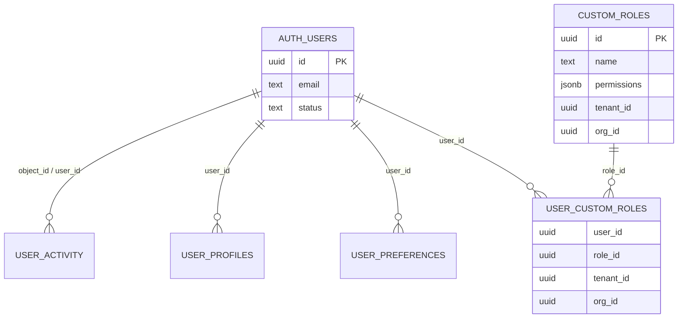
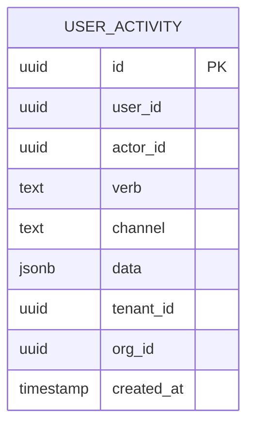
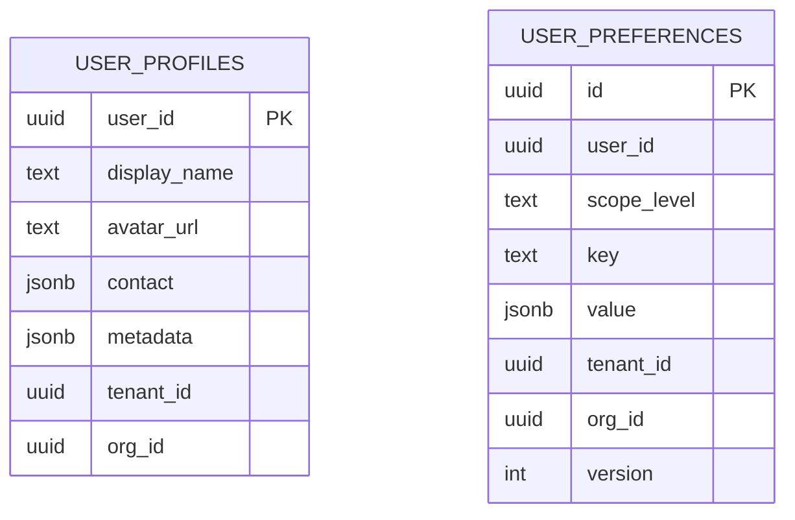

# Service Setup & Reference Guide

This guide ties together the last six phases of work. It documents how to wire
`users.Service`, what each command/query does, how hooks are emitted, and how
the shipped SQL schema fits together. Use it as the canonical reference when
integrating go-users into go-admin/go-cms.

For a higher-level overview of how these components plug into the admin stack,
cross-check [`go-admin-architecture-updated.md`](../go-admin-architecture-updated.md).
That document illustrates the transport boundaries while this guide focuses on
the concrete service/configuration surface area.

## Service Wiring

The service accepts every dependency via `users.Config` so transports can
inject Bun repositories, cache decorators, or remote adapters without touching
go-users internals.

```go
store, _ := activity.NewRepository(activity.RepositoryConfig{DB: bunDB})
registry := registry.NewRoleRegistry(registry.RoleRegistryConfig{DB: bunDB})
profileRepo := profile.NewRepository(bunDB)
preferenceRepo := preferences.NewRepository(bunDB)

svc := users.New(users.Config{
    AuthRepository:       goauth.NewUsersAdapter(authRepo),
    InventoryRepository:  goauth.NewUsersAdapter(authRepo), // optional if AuthRepository implements the interface
    ActivitySink:         store,
    ActivityRepository:   store,
    RoleRegistry:         registry,
    ProfileRepository:    profileRepo,
    PreferenceRepository: preferenceRepo,
    Hooks: types.Hooks{
        AfterLifecycle:        lifecycleNotifier,
        AfterRoleChange:       roleEventFanout,
        AfterPreferenceChange: preferenceWebhook,
        AfterActivity:         wsBroadcaster,
    },
    Clock:               types.SystemClock{},
    IDGenerator:         types.UUIDGenerator{},
    TransitionPolicy:    types.DefaultTransitionPolicy(),
    InviteTokenTTL:      72 * time.Hour,
    ScopeResolver:       multitenant.ScopeResolverFromClaims(),
    AuthorizationPolicy: multitenant.PolicyFromRoles(),
})

if err := svc.HealthCheck(ctx); err != nil {
    log.Fatal(err)
}
```

`Service.Ready()` returns `true` once the required dependencies are present:

- `AuthRepository`, `RoleRegistry`, `ActivitySink`
- Inventory, activity, profile, and preference repositories (the inventory and
  activity repos can be inferred from the injected auth repo and activity sink)
- `PreferenceResolver` (auto-built when a preference repository is provided)

### Scope Filter & Labels

Every command/query accepts a `types.ScopeFilter`. The struct now exposes:

```go
type ScopeFilter struct {
    TenantID uuid.UUID            // always available
    OrgID    uuid.UUID            // optional nested scope
    Labels   map[string]uuid.UUID // arbitrary layers (workspace, team, project…)
}
```

Helper methods keep label handling tidy:

- `WithLabel(key, id)` → returns a cloned filter with the normalized label set.
- `Label(key)` → reads the stored ID or `uuid.Nil`.
- `Clone()` → copies the filter so maps are not shared across goroutines.

Resolvers/policies should populate any extra levels they care about:

```go
resolver := types.ScopeResolverFunc(func(_ context.Context, actor types.ActorRef, requested types.ScopeFilter) (types.ScopeFilter, error) {
    claims := claimsFromContext(actor)
    scope := requested
    if scope.TenantID == uuid.Nil {
        scope.TenantID = claims.TenantID
    }
    if workspace := claims.WorkspaceID; workspace != uuid.Nil {
        scope = scope.WithLabel("workspace", workspace)
    }
    return scope, nil
})
```

Policies and downstream services can then inspect `ScopeFilter.Labels["workspace"]`
or `ScopeFilter.Label("team")` to make decisions without forcing every adopter
to share the same hierarchy.

### Field & Row Policies

Phase 3C wires the first set of default field/row policies into the CRUD adapter
layer so downstream transports get opinionated behavior out of the box:

- **Users (`crudsvc/user_service.go`)** – actors tagged with the `support` role
  only list/show their own record. `UserService.Index` rewrites
  `UserInventoryFilter.UserIDs` to the actor ID, drops any out-of-scope rows
  that still leak through repositories, and obfuscates email/contact metadata on
  leftover records before responding. `Show` returns `403` if the requested user
  ID differs from the actor.
- **Preferences (`crudsvc/preference_service.go`)** – the service rewrites
  `PreferenceFilter.UserID` for support actors, filters repository results to
  their ID, and rejects upsert/delete/show attempts that target a different
  user. Tenant/system admins retain full tenant visibility.
- **Activity (`crudsvc/activity_service.go`)** – support actors can only log or
  query their own activity trail, and every non–system admin actor receives
  responses with IP addresses redacted. Support actors also have the arbitrary
  `data` payload stripped to prevent accidental leakage of sensitive metadata.

These policies build on the guard so authorization still flows
`guard → policy → field masking`. The expectations are verified in
`crudsvc/policy_test.go`.

### Custom Actions

Some admin actions do not map 1:1 with plain CRUD. Instead of creating parallel
controllers you can register ad-hoc handlers that invoke existing commands once
the guard succeeds. The web demo mounts `POST /users/:id/password-reset`, which
calls `UserPasswordReset` through the same guard + actor resolution path and
then surfaces the result via flash messages. Treat these actions as thin
wrappers that translate HTTP payloads into command inputs so telemetry and
auditing stay centralized.

### Schema Registry & `/admin/schemas`

Phase 3D introduces `pkg/schema.Registry`, which consumes go-crud controller
metadata (each controller already implements `router.MetadataProvider`). The
registry serves two responsibilities:

1. **Register every controller** so schemas stay in sync with the transport:

   ```go
   registry := schema.NewRegistry(schema.WithPublisher(schemaNotifier))
   registry.Register(userController)
   registry.Register(roleController)
   ```

2. **Expose `/admin/schemas`** so go-admin/go-cms fetch the full catalog from a
   single endpoint:

   ```go
   srv.Router().
       Get("/admin/schemas", registry.Handler()).
       Name("admin:schemas").
       Tags("admin", "schemas")
   ```

3. **Fan out change notifications** via either `registry.Subscribe` (in-process)
   or `schema.Notifier` (plug into WebSockets, queues, or webhooks). Each
   subscriber receives the compiled OpenAPI document plus the resource list so
   dashboards can refresh without polling:

   ```go
   registry.Subscribe(func(ctx context.Context, snap schema.Snapshot) {
       cmsPublisher.Publish(ctx, snap.Document)
   })
   ```

`examples/web` wires all controllers into the registry, exposes
`/admin/schemas`, ships a `/admin/schema-demo` page that polls the endpoint, and
logs subscription callbacks so you can see the flow end to end. Pair a registry
subscription with the validation listener in `pkg/telemetry/validation` when you
need authenticated actors to request schema refreshes (e.g., go-cms asking for
the latest schema snapshot on login).

### Config Checklist

| Field | Required | Typical Provider | Notes |
| ----- | -------- | ---------------- | ----- |
| Field | Required | Typical Provider | Notes |
| ----- | -------- | ---------------- | ----- |
| `AuthRepository` | ✅ | go-auth adapter or custom implementation | Must satisfy lifecycle policy + inventory interface for default wiring |
| `InventoryRepository` | ⛔ (defaults to `AuthRepository`) | Bun repo or cached decorator | Override when read-load uses a different data source |
| `RoleRegistry` | ✅ | `registry.RoleRegistry` | Emits hooks + enforces scope |
| `ActivitySink` | ✅ | `activity.Repository` or custom sink | Logs all verbs; if it also satisfies `ActivityRepository` the service will reuse it |
| `ActivityRepository` | ✅ | Same as sink or read replica | Powers feed/stats queries |
| `ProfileRepository` | ✅ | `profile.Repository` | Required for profile command/query |
| `PreferenceRepository` | ✅ | `preferences.Repository` | Enables preference commands; also used by the resolver |
| `PreferenceResolver` | ⛔ (auto) | `preferences.NewResolver` | Provide your own to integrate remote config layers |
| `Hooks` | ⛔ | Struct of callbacks | Use to fan-out events to WebSockets, queues, etc. |
| `Clock`, `IDGenerator`, `Logger` | ⛔ | Defaults provided | Override for deterministic tests or structured logging |
| `TransitionPolicy` | ⛔ | `types.DefaultTransitionPolicy()` | Replace if your auth provider supports extra states |
| `InviteTokenTTL` | ⛔ | `72h` recommended | Governs invite expiration metadata |
| `ScopeResolver`, `AuthorizationPolicy` | ⛔ | Multitenant middleware | Wire both to enforce tenant/org scoping (see `docs/MULTITENANCY.md`) |

## Command Reference

All commands implement `go-command.Commander` so transports can treat them as
handler-agnostic units. Every execution flows through the shared scope guard
before touching repositories.

| Command | Policy Action | Activity Verb(s) | Description / Notes |
| ------- | ------------- | ---------------- | ------------------- |
| `UserLifecycleTransition` | `types.PolicyActionUsersWrite` | `user.lifecycle.transition` | Validates transition via `TransitionPolicy`, applies `UpdateStatus`, logs hooks + metadata. Result (optional) carries the updated `types.AuthUser`. |
| `BulkUserTransition` | `types.PolicyActionUsersWrite` | inherits from lifecycle command | Reuses the single-user command for batches of IDs; stops on first error and surfaces aggregate failures. |
| `UserInvite` | `types.PolicyActionUsersWrite` | `user.invite.created` | Creates pending auth users with deterministic token TTL metadata. Emits lifecycle + activity hooks so notification systems can send emails. |
| `UserPasswordReset` | `types.PolicyActionUsersWrite` | `user.password.reset` | Wraps upstream repository reset call, enforces actor + scope, and records audit payloads (reason + masked token if provided). |
| `CreateRole` / `UpdateRole` / `DeleteRole` | `types.PolicyActionRolesWrite` | `role.created`, `role.updated`, `role.deleted` | Proxy to the configured role registry while emitting hooks/events. Enforce scope uniqueness (name per tenant/org). |
| `AssignRole` / `UnassignRole` | `types.PolicyActionRolesWrite` | `role.assigned`, `role.unassigned` | Manage entries in `user_custom_roles`. Assign/unassign commands include the target `UserID` in emitted activity data. |
| `ActivityLog` | `types.PolicyActionActivityWrite` | custom verb supplied in input | Convenience command so other modules can write activity entries through the same validation + hook pipeline. |
| `ProfileUpsert` | `types.PolicyActionProfilesWrite` | `profile.updated` (via hooks) | Applies JSON merge semantics for `contact` + `metadata`, writes auditing columns, and triggers `AfterProfileChange`. |
| `PreferenceUpsert` | `types.PolicyActionPreferencesWrite` | `preference.upsert` | Persists (or overwrites) scoped key/value payloads, increments versions, and triggers resolver cache invalidation via hooks. |
| `PreferenceDelete` | `types.PolicyActionPreferencesWrite` | `preference.delete` | Soft delete semantics implemented through repository deletion; emits hook so caches drop derived layers. |

## Query Reference

| Query | Policy Action | Input Highlights | Output |
| ----- | ------------- | ---------------- | ------ |
| `UserInventoryQuery` | `types.PolicyActionUsersRead` | `types.UserInventoryFilter` (actor, scope, pagination, keyword, lifecycle statuses, role filter, specific IDs) | `types.UserInventoryPage` with normalized pagination + totals. |
| `RoleListQuery` | `types.PolicyActionRolesRead` | Scope, pagination, keyword, include-system flag | `types.RolePage` with assigned scope metadata. |
| `RoleDetailQuery` | `types.PolicyActionRolesRead` | Role ID + scope | `*types.RoleDefinition`. |
| `RoleAssignmentsQuery` | `types.PolicyActionRolesRead` | Role ID or User ID + scope | `[]types.RoleAssignment` for dashboards. |
| `ActivityFeed` | `types.PolicyActionActivityRead` | Scope, verbs, channels, actor/user/object filters, pagination | `types.ActivityPage` (records + totals + next offset). |
| `ActivityStatsQuery` | `types.PolicyActionActivityRead` | Scope, verb prefix, time window | `types.ActivityStats` (counts by verb/channel). |
| `ProfileQuery` | `types.PolicyActionProfilesRead` | User ID + scope | `*types.UserProfile` or `nil` if not created. |
| `PreferenceQuery` | `types.PolicyActionPreferencesRead` | User ID + scope + optional keys | `types.PreferenceSnapshot` (effective map + trace of layers). |

## Hook Contracts

Hooks are optional callbacks supplied via `users.Config.Hooks`. Each callback
receives a strongly typed payload and is invoked after storage succeeds.

| Hook | Payload Fields | Emitted By | Notes |
| ---- | -------------- | ---------- | ----- |
| `AfterLifecycle(context.Context, types.LifecycleEvent)` | `UserID`, `ActorID`, `FromState`, `ToState`, `Reason`, `Scope`, `Metadata`, `OccurredAt` | Lifecycle + bulk transition commands, invite (initial pending state) | Use to push notifications or update search indexes. |
| `AfterRoleChange(ctx, types.RoleEvent)` | `RoleID`, `UserID` (for assignment events), `Action`, `Role`, `Scope`, `ActorID`, `OccurredAt` | All role commands | Actions follow `role.created`, `role.updated`, `role.deleted`, `role.assigned`, `role.unassigned`. |
| `AfterPreferenceChange(ctx, types.PreferenceEvent)` | `UserID`, `Key`, `Action`, `Scope`, `ActorID`, `OccurredAt` | Preference upsert/delete | Ideal for invalidating caches or calling go-settings. |
| `AfterProfileChange(ctx, types.ProfileEvent)` | `UserID`, `Scope`, `ActorID`, `Profile`, `OccurredAt` | Profile upsert | Useful for syncing avatars/contact info outward. |
| `AfterActivity(ctx, types.ActivityRecord)` | Full activity row | Any command that logs an activity entry OR the standalone `ActivityLog` command | Fired after persistence so WebSocket broadcasters can stream audit data. |

All hooks run asynchronously (best-effort) and should be defensive: swallow
panics or return errors to avoid blocking upstream transports.

## Schema Overview

Each migration adds a focused slice of storage. The diagrams below show how the
tables relate to each other and to upstream auth users.







Each table includes tenant/org columns defaulting to the zero UUID so single
tenant deployments can omit scope filters while multi-tenant apps fill them to
maintain isolation. See `docs/ROLE_REGISTRY.md`, `docs/ACTIVITY.md`, and
`docs/PROFILES_PREFERENCES.md` for detailed field descriptions.

## Related Documents

- [Examples (`docs/EXAMPLES.md`)](EXAMPLES.md)
- [Activity Sink](ACTIVITY.md)
- [Role Registry](ROLE_REGISTRY.md)
- [Profiles & Preferences](PROFILES_PREFERENCES.md)
- [Multi-Tenancy Guard](MULTITENANCY.md)
